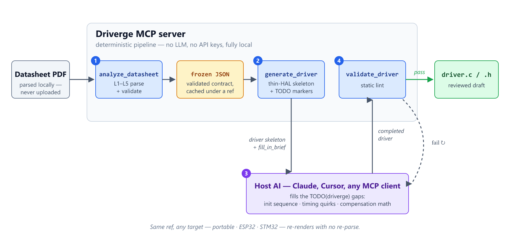

<p align="center">
  
</p>
<p align="center"><em>Datasheet PDF → embedded C/C++ driver, from any MCP client.</em></p>

<p align="center">
  <a href="https://www.npmjs.com/package/driverge-mcp"></a>
  <a href="https://github.com/MehmetTopuz/driverge-mcp/actions/workflows/ci.yml"></a>
  <a href="LICENSE"></a>
  
  
</p>

> 🧪 **Closed beta** — install with **`npm i driverge-mcp@beta`** or run directly
> with `npx -y driverge-mcp@beta`. Generated drivers are reviewed *drafts*, not
> hardware-certified firmware, and the JSON schema may still change before the
> stable **v0.1.0** — see [Maturity & status](#maturity--status), and
> [BETA.md](BETA.md) if you're testing.

---

**Contents:** [What is Driverge?](#what-is-driverge) ·
[Quick start](#quick-start) · [Why Driverge?](#why-driverge) ·
[What it does](#what-it-does) · [Maturity & status](#maturity--status) ·
[Concepts](#concepts-behind-driverge) · [Installation](#installation) ·
[Usage](#usage) · [Troubleshooting](#troubleshooting) · [Roadmap](#roadmap)

## What is Driverge?

**Driverge is a client-agnostic [MCP](https://modelcontextprotocol.io) server**
that turns an IC datasheet PDF into an embedded C/C++ driver. It plugs into any
MCP-capable host — Claude Desktop, Claude Code (VS Code), Cursor, and others.

Its guiding principle: **deterministic code parses and validates; the host AI
reasons.** Driverge contains **no internal LLM and needs no API keys** — a
TypeScript pipeline extracts a *validated, structured JSON* model of the chip,
and the host AI you're already talking to fills in the reasoning-heavy parts
(init sequence, vendor quirks, docs). Your datasheet never leaves your machine.

<p align="center">
  
</p>

## Quick start

Add one entry to your MCP client's config (Claude Desktop, Claude Code, Cursor —
paths per client in [Installation](#installation)):

```json
{
  "mcpServers": {
    "driverge": { "command": "npx", "args": ["-y", "driverge-mcp"] }
  }
}
```

Restart the client, then ask:

> "Analyze the datasheet at `C:/ds/bme280.pdf` with driverge, then generate a
> portable driver."

That's it — no clone, no build, no API key. Details in
[Installation](#installation) and [Usage](#usage).

## Why Driverge?

Bringing up a new sensor or IC means hand-transcribing dozens of register
addresses, bit-field masks, and command codes out of a 40-page PDF — slow work,
and a classic source of silent bugs (one wrong mask and the driver "works" but
reads garbage). Driverge does that mechanical part deterministically and leaves
the judgment to the AI you already use.

- **No hallucinated register maps.** Addresses, masks, and command codes are
  *extracted from the datasheet and validated* — not guessed. Invalid or
  incomplete data is rejected before it can become code.
- **Bring your own client — private by design.** A plain MCP server with no
  embedded LLM: it reasons with the model you're already paying for, and the
  datasheet is parsed locally, never uploaded — safe for NDA'd parts.
- **Deterministic & reproducible.** The same PDF always yields the same JSON and
  the same driver skeleton — reviewable, diff-able, and testable.
- **Portable by construction.** One driver core targets any platform through a
  tiny per-bus thin-HAL seam; native targets (STM32, ESP32) pre-fill it. The AI
  completes only the marked `TODO(driverge)` gaps, and `validate_driver` checks
  the result.

**Good for:** quickly evaluating a new sensor, prototyping, porting an existing
driver to a different MCU, or just learning an unfamiliar chip's register map.

## What it does

1. **Analyze** a datasheet PDF → detect format, manufacturer, and interface kind
   (register-map vs. command-set), then extract registers / bit-fields (or
   commands + CRC) and the bus protocol into a **frozen JSON contract**, gated by
   a validator.
2. **Generate** a driver for a target platform, in C or C++: a deterministic
   **thin-HAL skeleton** — register/bit-field constants, the per-bus seam,
   function stubs — with every reasoning gap marked `TODO(driverge)` plus a
   `fill_in_brief` telling the host AI exactly what to complete.
3. **Validate** the completed driver: thin-HAL purity, no leftover TODOs,
   register references exist, bit-field masks match the JSON.

### Supported targets

Every target specializes the same portable
**[thin-HAL](https://en.wikipedia.org/wiki/Hardware_abstraction_layer)** seam —
the driver core is identical across platforms; only the seam implementation
changes.

| Target | Bus binding | Buses | Language | Maturity |
|---|---|---|---|---|
| **Portable (thin-HAL)** | user-implemented `hal_*` seam | I²C, SPI, UART, CAN | C / C++ | **Beta** — host-tested, gcc-compiled in CI; not yet on hardware |
| **ESP32** | ESP-IDF (`i2c_master_*`, `spi_master`, `uart`, TWAI) | I²C, SPI, UART, CAN | C / C++ | **Experimental** — one informal I²C bring-up; SPI/UART/CAN never on hardware |
| **STM32** | CubeHAL (`HAL_I2C_*`, `HAL_SPI_*` + GPIO CS, `HAL_UART_*`) | I²C, SPI, UART | C / C++ | **Experimental** — never on hardware |
| **Arduino** | `Wire` / `SPI` | — | C++ | not implemented |

STM32 CAN is planned (the bxCAN/FDCAN family split needs its own pass), and a
next wave of native targets — RP2040/RP2350, TI MSPM0, NXP MCX/i.MX RT,
Nuvoton NuMicro, Microchip PIC, and eventually Zephyr — is on the
[Roadmap](#roadmap). Asking a target for a bus it doesn't support fails fast
with a clear `UnsupportedBusError` rather than emitting a wrong seam. Pass
`language: "cpp"` to `generate_driver` for a class-based C++ driver
(`.hpp`/`.cpp`) instead of the default C output — same registers, same seam,
same validation. What "Beta" and "Experimental" mean exactly is spelled out in
[Maturity & status](#maturity--status).

### Verified parts

The extraction pipeline is regression-tested against real datasheets from
**12 manufacturers**. Parts with fully automatic extraction:

| Part | Manufacturer | Kind | Extracted |
|---|---|---|---|
| BME280 | Bosch Sensortec | register map | 16 regs, 19 bit-fields |
| MCP23017 | Microchip | register map | 12 regs, 96 bit-fields |
| SHT3x | Sensirion | command set | 6 commands + CRC |
| TMAG5170 | Texas Instruments | register map (SPI) | 21 regs, 79 bit-fields |
| DHT20 | Aosong | command set | 2 commands |
| LSM6DSRX | STMicroelectronics | register map | 31 regs, 91 bit-fields |
| MAX30102 | Maxim Integrated | register map | 20 regs, 33 bit-fields |

Other tested parts (ADXL345, MLX90614, AEAT-8811, PCA9685, VL53L3CX, TLE5014)
extract **partially** or **defer** to the host AI — the pipeline says so
explicitly instead of guessing. The full, always-current matrix lives in the
[coverage scorecard](tests/scorecard/scorecard.snap.md).

## Maturity & status

Driverge is in **closed beta** (`0.1.0-beta.x`, npm `beta` dist-tag).

**Proven today (host-level):**
- The full deterministic test suite is green (440-plus tests) on a clean
  TypeScript build, and the **portable** driver is compiled by a real `gcc`
  gate in CI.
- The extraction pipeline is regression-tested against **13 real datasheets**
  and reports its own coverage honestly — 7 fully extracted, 3 partial, 3
  deferred (see the [coverage scorecard](tests/scorecard/scorecard.snap.md)).

**Not yet proven — this is the beta → v0.1.0 gate:**
- **On-hardware behavior is not gated.** Only one informal ESP32 bring-up has
  run (MPU-9250, hand-completed); there is no clean, repeatable hardware pass
  yet, and STM32 has never run on silicon.
- The native ESP32/STM32 seams are not yet built by an automated compile gate
  (ESP-IDF / CubeIDE) — only the portable target is.
- Only one MCP client has been exercised end-to-end.

> ⚠️ Treat every generated driver as a **reviewed draft**: check register
> addresses, the init sequence, and any compensation math against the datasheet
> before you flash it. Driverge is not safety-certified.

**Testing the beta?** [BETA.md](BETA.md) has the identity-register smoke test to
run and how to send a field report.

## Concepts behind Driverge

Driverge splits driver-writing into two kinds of work: the **mechanical part**
(register addresses, masks, command tables — extracted and checked by
deterministic code) and the **judgment part** (init ordering, timing quirks,
compensation math — completed by the host AI). Everything below exists to keep
that boundary sharp; the diagram at the top of this page shows how the pieces
connect.

### Deterministic core, reasoning at the edge

Register geometry is mechanical: an address is right or wrong, a mask either
matches the datasheet or it doesn't. Driverge handles that part with plain
TypeScript — no sampling, so the output is the same on every run. What genuinely
needs judgment (in what order to poke the registers, which timing quirk applies)
is left to the host AI.

### The frozen JSON contract

`analyze_datasheet` runs a five-stage pipeline (L1–L5): detect the PDF type,
map keyword pages, identify the manufacturer and interface kind, extract the
register table (or command set + CRC), and validate the result against a frozen
draft-07 [JSON-Schema contract](schemas/datasheet.schema.json) — also exposed
as the `driverge://schema` resource. Anything that fails validation is rejected
*before* code generation, so a bad extraction can never silently become a bad
driver.

### The `ref` handle

Parsing a datasheet yields a large JSON document; shuttling it through the chat
context on every call would be slow and lossy. Instead, the parsed model is
cached server-side under a content-stable `ref`, and the tools pass that handle
around. The same `ref` with a different `target` re-renders instantly with no
re-parse, and the full JSON stays readable at `driverge://datasheet/<ref>`.

### The thin-HAL seam

Generated drivers touch hardware through a tiny per-bus seam — and nothing
else:

| Bus | Seam functions (plus `hal_delay_ms`) |
|---|---|
| I²C | `hal_i2c_read`, `hal_i2c_write` |
| SPI | `hal_spi_transfer` (one call = one CS-framed transaction) |
| UART | `hal_uart_write`, `hal_uart_read` |
| CAN | `hal_can_transfer` (one call = one frame exchange) |

The transfer seams return `int` — **`0` on success, non-zero on a bus error**
(NACK, timeout) — and the generated register accessors propagate that status
instead of swallowing it; native seams (ESP32, STM32) return their vendor
status, which is already `0` on success. `validate_driver` enforces seam
purity: a driver that calls a vendor peripheral API outside the seam fails the
lint. Buses with no universal register-access primitive (UART, CAN) get their
device-specific framing as a marked `TODO(driverge)` gap, completed by the host
AI and then linted.

### The fill-in loop

The skeleton marks every reasoning gap with a `TODO(driverge)` comment and
ships a `fill_in_brief` describing what belongs there. The host AI completes
the markers using the datasheet resource, then `validate_driver` statically
checks the result — no leftover TODOs, every register reference real, masks
matching the JSON — and the loop repeats until it passes.

## Installation

**Prerequisites:** Node.js LTS (≥ 18; CI-tested on Node 20 & 22).

Install the beta from npm:

```bash
npm i driverge-mcp@beta
```

Or skip the install entirely — the config below launches Driverge via
[npx](https://docs.npmjs.com/cli/commands/npx), which downloads it from npm on
first run, caches it, and starts it automatically each time the client does
(`-y` skips npx's install prompt). Add one entry to your MCP client's config:

```json
{
  "mcpServers": {
    "driverge": { "command": "npx", "args": ["-y", "driverge-mcp"] }
  }
}
```

| Client | Config file |
|---|---|
| Claude Desktop | `claude_desktop_config.json` |
| Claude Code (VS Code) | `.mcp.json` in your workspace root |
| Cursor | `.cursor/mcp.json` |
| Others (Codex, Gemini CLI, …) | same `command` + `args` pair in their own MCP config |

> **Beta testers:** pin the beta channel explicitly with `["-y",
> "driverge-mcp@beta"]` as the `args`. Plain `driverge-mcp` resolves the npm
> `latest` tag, which deliberately lags the beta during closed beta.

You never run the server by hand — to confirm it's wired up, ask your client to
run the `ping` tool, which replies `pong`. On Windows, prefer writing the
config file directly over `claude mcp add` — see
[Troubleshooting](#troubleshooting). Cloning the repo (below) is only for
development.

### Configuration

| Env var | Default | Purpose |
|---|---|---|
| `DRIVERGE_OUT_ROOT` | server's working directory | Root that `generate_driver`'s `out_dir` writes are confined to. Any `out_dir` that resolves outside this root is rejected (`out_dir "…" escapes the allowed root`). Set it to the directory you want drivers written into. |

Set it in the MCP config's `env` block, e.g.:

```json
{
  "mcpServers": {
    "driverge": {
      "command": "npx",
      "args": ["-y", "driverge-mcp"],
      "env": { "DRIVERGE_OUT_ROOT": "C:/work/drivers" }
    }
  }
}
```

Without `out_dir` the generated files are returned in the tool result only —
no disk writes, no configuration needed.

### Run from source (development)

To contribute, or to run the latest unreleased changes:

```bash
git clone https://github.com/MehmetTopuz/driverge-mcp.git
cd driverge-mcp
npm install
npm run build
```

Then point your client at the built entry point:
```json
{
  "mcpServers": {
    "driverge": { "command": "node", "args": ["/absolute/path/to/dist/server.js"] }
  }
}
```

## Usage

Give your MCP client a datasheet and ask it to build a driver. The typical flow:

1. **`analyze_datasheet`** — `{ "pdf_path": "/abs/path/bme280.pdf" }` → returns a
   compact summary and a `ref` handle; the full JSON is available as a resource.
   If auto-detection picks the wrong vendor or interface style, the optional
   `manufacturer_hint` (free text) and `interface_kind_hint`
   (`"register_map"` | `"command_set"`) parameters steer it.
2. **`generate_driver`** — `{ "ref": "…", "target": "portable" }` → returns the
   driver files + a `fill_in_brief`. (`out_dir` also writes them to disk;
   `language: "cpp"` renders a class-based `.hpp`/`.cpp` driver instead of the
   default C.)
3. The host AI completes the `TODO(driverge)` markers using the brief and the
   `driverge://datasheet/<ref>` resource.
4. **`validate_driver`** — `{ "ref": "…", "files": [...] }` → static checks; loop
   until it passes.

Reusing the same `ref` with a different `target` re-renders with **no re-parse**.

**Completing a `deferred` datasheet.** When `analyze_datasheet` reports
`extraction: deferred`, the host AI reconstructs the register map from the
`driverge://datasheet/<ref>` resource and persists it back with
`validate_datasheet({ "ref": "…", "json": { … } })` — passing **both** `ref` and
the completed `json` overwrites the cached datasheet under that `ref`, so the
next `generate_driver` renders the real registers instead of a TODO stub.

### Worked example — BME280 → portable driver

> "Analyze the datasheet at `C:/ds/bme280.pdf` with driverge, then generate a
> portable driver."

Driverge parses the BME280 memory map (16 registers, 19 bit-fields, I²C
address), validates it, and emits `bme280.h` / `bme280.c` — register
`#define`s, bit-field `MASK`/`SHIFT` macros, the thin-HAL seam, and the
`bme280_init/read_register/write_register` stubs:

```c
/* bme280.h — generated by Driverge (excerpt) */
#define BME280_I2C_ADDR 0x76

#define BME280_REG_CTRL_MEAS 0xF4
#define BME280_REG_STATUS    0xF3
/* … */
#define BME280_TEMP_XLSB_TEMP_XLSB_MASK  0xF0
#define BME280_TEMP_XLSB_TEMP_XLSB_SHIFT 4
```

```c
/* bme280.c — every reasoning gap is a marked TODO (excerpt) */
int bme280_init(bme280_t *dev) {
    /* … */
    /* TODO(driverge): implement the power-on / reset init sequence — the
     * correct register write order and values, plus any required startup
     * delay. See fill_in_brief.init_sequence_todo. */
    return 0;
}
```

The host AI then fills the init sequence and compensation docs from the
datasheet prose, and `validate_driver` checks the result.

### MCP surface

| Kind | Name | Purpose |
|---|---|---|
| Tool | `analyze_datasheet` | PDF → validated JSON, cached under a `ref` |
| Tool | `generate_driver` | `ref` + `target` → driver skeleton + `fill_in_brief` |
| Tool | `validate_driver` | static-lint a completed driver against its `ref` |
| Tool | `validate_datasheet` | re-run the validator over a `ref` or JSON; passing **both** persists the completed datasheet under that `ref` |
| Tool | `ping` | health check — confirms the server is running |
| Resource | `driverge://datasheet/<ref>` | full parsed JSON for an analyzed datasheet |
| Resource | `driverge://schema` | the frozen datasheet JSON-Schema contract |
| Prompt | `generate-driver` | guided analyze → generate → fill → validate flow |

## Troubleshooting

- **Is the server even running?** Ask your client to run the `ping` tool — it
  replies `pong`. If npx fails to start, check `node --version` (≥ 18 required).
- **Scanned / image-only PDFs.** Driverge parses text-based PDFs; scanned or
  mixed PDFs are detected and reported with an explicit warning, and parsing
  will be incomplete (OCR is deferred to a future release).
- **`extraction: partial` or `deferred` is not a failure.** `partial` means the
  registers were found but detail (e.g. bit-fields) is incomplete; `deferred`
  means the register/command section was detected but not auto-extracted. In
  both cases the generated skeleton tells the host AI exactly what to complete
  from the datasheet resource. Only `none` is a genuine parse failure.
- **`out_dir "…" escapes the allowed root`.** Disk writes are confined under
  `DRIVERGE_OUT_ROOT` (default: the server's working directory) — see
  [Configuration](#configuration).
- **`UnsupportedBusError` on a native target.** The target doesn't support that
  part's bus yet (today that means CAN on STM32, or a bus the parser couldn't
  identify). Generate the **portable** target instead and implement its seam.
- **Windows: prefer editing the config file over the `claude mcp add` CLI.**
  `claude mcp add … -- npx -y driverge-mcp` can eat the `-y` itself (`unknown
  option '-y'`), and PowerShell 5.1 mangles the nested quotes in `claude mcp
  add-json`. Writing the JSON block directly into `.mcp.json` /
  `claude_desktop_config.json` sidesteps both.
- **Windows: spawning the server from your own script.** Launching `npx.cmd`
  from Node needs `shell: true` (otherwise `spawn EINVAL`). MCP clients handle
  this for you; it only bites custom smoke-test scripts.
- **"Pending approval" in `claude mcp list`.** A project-scope `.mcp.json` may
  show as `⏸ Pending approval` in a separate `claude mcp list` process while
  the `driverge` tools are already callable in your active session — the
  listing lags the running session.

## Roadmap

- **v0.x** — one reference sensor (BME280), portable thin-HAL core, MCP surface,
  multiple clients. ✅
- **v0.y** — native codegen: ESP32 ✅, STM32 ✅ *(on-hardware verification is the
  beta → v0.1.0 gate)*, Arduino (next); multi-manufacturer extraction ✅
  (12 vendors — see [Verified parts](#verified-parts)); multi-bus seam families
  (I²C, SPI, UART, CAN) ✅; C or C++ output ✅. *(current)*
- **v1.0** — broader vendor/part coverage, STM32 CAN (bxCAN/FDCAN), and a
  stable, versioned JSON schema.
- **v1.x** — new native MCU targets (same portable thin-HAL core, one seam
  file per platform; prioritized by beta-tester demand): **RP2040/RP2350**
  (pico-sdk), **TI MSPM0** (DriverLib), **NXP MCX / i.MX RT** (MCUXpresso
  `fsl_lpi2c`/`fsl_lpspi`), **Nuvoton NuMicro** (BSP Standard Driver), and
  **Microchip PIC** (MCC Melody for 8/16-bit; Harmony v3 for PIC32).
- **Later** — a **Zephyr** meta-target (devicetree-based `i2c`/`spi` API):
  one seam covering Nordic nRF and every other Zephyr-supported vendor.

Day-to-day progress is tracked in the [CHANGELOG](CHANGELOG.md).

## Contributing

See [CONTRIBUTING.md](CONTRIBUTING.md) for dev setup, the commit convention, and
the test-driven workflow. Issues and PRs welcome.

## Security & disclaimer

Generated drivers are drafts intended for human review, not certified firmware —
see [SECURITY.md](SECURITY.md). Driverge runs locally and does not transmit your
datasheets.

## License

[MIT](LICENSE) © Mehmet Topuz
