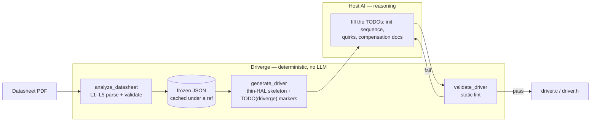

<p align="center">
  
</p>
<p align="center"><em>Datasheet PDF → embedded C/C++ driver, from any MCP client.</em></p>

<p align="center">
  <a href="https://www.npmjs.com/package/driverge-mcp"></a>
  <a href="https://github.com/MehmetTopuz/driverge-mcp/actions/workflows/ci.yml"></a>
  <a href="LICENSE"></a>
  
  
</p>

> 🚧 **Early pre-release** — [`driverge-mcp`](https://www.npmjs.com/package/driverge-mcp)
> is on npm, so the `npx driverge-mcp` install below works today. APIs and the
> JSON schema may still change before v0.1.0; expect rough edges.

---

## What is Driverge?

**Driverge is a client-agnostic [MCP](https://modelcontextprotocol.io) server**
that turns an IC datasheet PDF into an embedded C/C++ driver. It plugs into any
MCP-capable host — Claude Desktop, Claude Code (VS Code), Cursor, and others.

Its guiding principle: **deterministic code parses and validates; the host AI
reasons.** Driverge itself contains **no internal LLM and needs no API keys** — a
TypeScript pipeline extracts a *validated, structured JSON* model of the chip, and
the host AI you're already talking to fills in the reasoning-heavy parts (init
sequence, vendor quirks, docs). Your datasheet never leaves your machine.

## Quick start

Add one entry to your MCP client's config (Claude Desktop, Claude Code, Cursor —
paths per client in [Installation](#installation)):

```json
{
  "mcpServers": {
    "driverge": { "command": "npx", "args": ["-y", "driverge-mcp"] }
  }
}
```

Restart the client, then ask:

> "Analyze the datasheet at `C:/ds/bme280.pdf` with driverge, then generate a
> portable driver."

That's it — no clone, no build, no API key. Details in
[Installation](#installation) and [Usage](#usage).

## Why Driverge?

Bringing up a new sensor or IC means hand-transcribing dozens of register
addresses, bit-field masks, and command codes out of a 40-page PDF — slow work,
and a classic source of silent bugs (one wrong mask or transposed address and the
driver "works" but reads garbage). Driverge does that mechanical part
deterministically and leaves the reasoning to the AI you already use.

- **No hallucinated register maps.** Addresses, bit-field masks, and command codes
  are *extracted from the datasheet and validated* — not guessed. That's the
  failure mode of "just ask an LLM to write the whole driver"; here, invalid or
  incomplete data is rejected before it ever reaches code generation.
- **Bring your own client — no API keys, no lock-in.** Driverge is a plain MCP
  server with no embedded LLM. It runs inside whatever MCP client you already use
  (Claude Desktop, Claude Code, Cursor, …) and reasons with the model you're
  already paying for — no separate subscription or service.
- **Private & offline.** The datasheet is parsed locally and never uploaded — safe
  for NDA'd or unreleased parts.
- **Deterministic & reproducible.** The same PDF always yields the same JSON and
  the same driver skeleton — reviewable, diff-able, and testable, not a one-shot
  black box.
- **Portable by construction.** One driver core targets any platform through a
  five-function thin-HAL seam; the native targets (STM32, ESP32) pre-fill that
  seam for you — switch platforms without touching driver logic.
- **The AI does only what it's good at.** Register geometry is deterministic;
  init-sequence ordering, timing quirks, and compensation math need judgment.
  Driverge marks exactly those spots with `TODO(driverge)` and a `fill_in_brief`,
  the host AI completes them, then `validate_driver` checks the result.

**Good for:** quickly evaluating a new sensor, prototyping, porting an existing
driver to a different MCU, or just learning an unfamiliar chip's register map.

## What it does

1. **Analyze** a datasheet PDF → detect format, manufacturer, and interface kind
   (register-map vs. command-set), then extract registers / bit-fields (or
   commands + CRC) and the bus protocol into a **frozen JSON contract**, gated by
   a validator.
2. **Generate** a driver for a target platform: a deterministic **thin-HAL
   skeleton** — register/bit-field constants, the five-function thin-HAL seam,
   function stubs — with every reasoning gap marked `TODO(driverge)` plus a `fill_in_brief`
   telling the host AI exactly what to complete.
3. **Validate** the completed driver: thin-HAL purity, no leftover TODOs, register
   references exist, bit-field masks match the JSON.

### Supported targets

Every target specializes the same portable **[thin-HAL](https://en.wikipedia.org/wiki/Hardware_abstraction_layer)**
seam — the driver core is identical across platforms; only the seam implementation
changes.

| Target | Bus binding | Buses | Language | Status |
|---|---|---|---|---|
| **Portable (thin-HAL)** | user-implemented `hal_i2c_*` / `hal_spi_*` / `hal_delay_ms` | I²C + SPI | C | ✅ |
| **ESP32** | ESP-IDF `i2c_master_*` | I²C only | C | ✅ |
| **STM32** | CubeHAL `HAL_I2C_Mem_Read/Write` | I²C only | C | ✅ |
| **Arduino** | `Wire` / `SPI` | — | C++ | planned |

SPI parts work with the **portable** target today; asking the ESP32/STM32
targets for an SPI part fails fast with a clear `UnsupportedBusError` rather
than emitting a wrong seam.

> ⚠️ **Generated code is a strong draft, not a certified driver.** Init sequences,
> compensation formulas, and timing quirks are completed by the host AI and
> **must be reviewed** before use on hardware. Not safety-certified.

### Verified parts

The extraction pipeline is regression-tested against real datasheets from
**12 manufacturers**. Parts with fully automatic extraction (registers *and*
bit-fields, or a clean command set):

| Part | Manufacturer | Kind | Extracted |
|---|---|---|---|
| BME280 | Bosch Sensortec | register map | 16 regs, 19 bit-fields |
| MCP23017 | Microchip | register map | 12 regs, 96 bit-fields |
| SHT3x | Sensirion | command set | 6 commands + CRC |
| TMAG5170 | Texas Instruments | register map (SPI) | 21 regs, 79 bit-fields |
| DHT20 | Aosong | command set | 2 commands |
| LSM6DSRX | STMicroelectronics | register map | 31 regs, 91 bit-fields |
| MAX30102 | Maxim Integrated | register map | 20 regs, 33 bit-fields |

Other tested parts (ADXL345, MLX90614, AEAT-8811, PCA9685, VL53L3CX, TLE5014)
extract **partially** or **defer** to the host AI — the pipeline says so
explicitly instead of guessing, and the generated skeleton tells the host AI
what to complete. The full, always-current matrix lives in the
[coverage scorecard](tests/scorecard/scorecard.snap.md).

## Concepts behind Driverge

Driverge splits driver-writing into two kinds of work: the **mechanical part**
(register addresses, masks, command tables — extracted and checked by
deterministic code) and the **judgment part** (init ordering, timing quirks,
compensation math — completed by the host AI). Everything below exists to keep
that boundary sharp.



### Deterministic core, reasoning at the edge

Register geometry is mechanical: an address is right or wrong, a mask either
matches the datasheet or it doesn't. Driverge handles that part with plain
TypeScript — no internal LLM, no API keys, no sampling — so the output is the
same on every run. What genuinely needs judgment (in what order to poke the
registers, which timing quirk applies, how to document a compensation formula)
is left to the host AI you're already talking to.

### The frozen JSON contract

`analyze_datasheet` runs a five-stage pipeline (L1–L5): detect the PDF type,
map keyword pages, identify the manufacturer and interface kind, extract the
register table (or command set + CRC), and validate the result against a frozen
draft-07 [JSON-Schema contract](schemas/datasheet.schema.json) — also exposed
as the `driverge://schema` resource. Anything that fails validation is rejected
*before* code generation, so a bad extraction can never silently become a bad
driver.

### The `ref` handle

Parsing a datasheet yields a large JSON document; shuttling it through the chat
context on every call would be slow and lossy. Instead, the parsed model is
cached server-side under a content-stable `ref`, and the tools pass that handle
around. The same `ref` with a different `target` re-renders instantly with no
re-parse, and the full JSON stays readable at `driverge://datasheet/<ref>`.

### The thin-HAL seam

Generated drivers touch hardware through exactly five functions —
`hal_i2c_read` / `hal_i2c_write` (or the SPI pair) plus `hal_delay_ms` — and
nothing else. The driver core is therefore identical across platforms; a native
target (ESP32, STM32) just pre-fills the seam with the vendor calls.
`validate_driver` enforces this purity: a driver that calls a vendor peripheral
API outside the seam fails the lint.

### The fill-in loop

The skeleton marks every reasoning gap with a `TODO(driverge)` comment and
ships a `fill_in_brief` describing what belongs there. The host AI completes
the markers using the datasheet resource, then `validate_driver` statically
checks the result — no leftover TODOs, every register reference real, masks
matching the JSON — and the loop repeats until it passes.

## Installation

**Prerequisites:** Node.js LTS (≥ 18; CI-tested on Node 20 & 22).

Add Driverge to your MCP client (no build step —
[npx](https://docs.npmjs.com/cli/commands/npx) fetches and runs it):

**Claude Desktop** — `claude_desktop_config.json`:
```json
{
  "mcpServers": {
    "driverge": { "command": "npx", "args": ["-y", "driverge-mcp"] }
  }
}
```

**Claude Code (VS Code)** — `.mcp.json` in your workspace root:
```json
{
  "mcpServers": {
    "driverge": { "command": "npx", "args": ["-y", "driverge-mcp"] }
  }
}
```

**Cursor** — `.cursor/mcp.json`:
```json
{
  "mcpServers": {
    "driverge": { "command": "npx", "args": ["-y", "driverge-mcp"] }
  }
}
```

Other clients (Codex, Gemini CLI, …) take the same `command` + `args` pair in
their own MCP config.

**No clone, no global install.** The config above tells your MCP client to
launch `npx -y driverge-mcp`; npx downloads Driverge from the npm registry on
first run, caches it, and starts it automatically each time the client does
(`-y` skips npx's install prompt). You never run it by hand — to confirm it's
wired up, ask your client to run the `ping` tool, which replies `pong`. Cloning
the repo (below) is only for development.

### Configuration

| Env var | Default | Purpose |
|---|---|---|
| `DRIVERGE_OUT_ROOT` | server's working directory | Root that `generate_driver`'s `out_dir` writes are confined to. Any `out_dir` that resolves outside this root is rejected (`out_dir "…" escapes the allowed root`). Set it to the directory you want drivers written into. |

Set it in the MCP config's `env` block, e.g.:

```json
{
  "mcpServers": {
    "driverge": {
      "command": "npx",
      "args": ["-y", "driverge-mcp"],
      "env": { "DRIVERGE_OUT_ROOT": "C:/work/drivers" }
    }
  }
}
```

Without `out_dir` the generated files are returned in the tool result only —
no disk writes, no configuration needed.

### Run from source (development)

To contribute, or to run the latest unreleased changes:

```bash
git clone https://github.com/MehmetTopuz/driverge-mcp.git
cd driverge-mcp
npm install
npm run build
```

Then point your client at the built entry point:
```json
{
  "mcpServers": {
    "driverge": { "command": "node", "args": ["/absolute/path/to/dist/server.js"] }
  }
}
```

## Usage

Give your MCP client a datasheet and ask it to build a driver. The typical flow:

1. **`analyze_datasheet`** — `{ "pdf_path": "/abs/path/bme280.pdf" }` → returns a
   compact summary and a `ref` handle; the full JSON is available as a resource.
   If auto-detection picks the wrong vendor or interface style, the optional
   `manufacturer_hint` (free text) and `interface_kind_hint`
   (`"register_map"` | `"command_set"`) parameters steer it.
2. **`generate_driver`** — `{ "ref": "…", "target": "portable" }` → returns the
   driver files + a `fill_in_brief`. (`out_dir` also writes them to disk.)
3. The host AI completes the `TODO(driverge)` markers using the brief and the
   `driverge://datasheet/<ref>` resource.
4. **`validate_driver`** — `{ "ref": "…", "files": [...] }` → static checks; loop
   until it passes.

Reusing the same `ref` with a different `target` re-renders with **no re-parse**.

### Worked example — BME280 → portable driver

> "Analyze the datasheet at `C:/ds/bme280.pdf` with driverge, then generate a
> portable driver."

Driverge parses the BME280 memory map (16 registers, 19 bit-fields, I²C
address), validates it, and emits `bme280.h` / `bme280.c` — register
`#define`s, bit-field `MASK`/`SHIFT` macros, the thin-HAL seam, and the
`bme280_init/read_register/write_register` stubs:

```c
/* bme280.h — generated by Driverge (excerpt) */
#define BME280_I2C_ADDR 0x76

#define BME280_REG_CTRL_MEAS 0xF4
#define BME280_REG_STATUS    0xF3
/* … */
#define BME280_TEMP_XLSB_TEMP_XLSB_MASK  0xF0
#define BME280_TEMP_XLSB_TEMP_XLSB_SHIFT 4
```

```c
/* bme280.c — every reasoning gap is a marked TODO (excerpt) */
int bme280_init(bme280_t *dev) {
    /* … */
    /* TODO(driverge): implement the power-on / reset init sequence — the
     * correct register write order and values, plus any required startup
     * delay. See fill_in_brief.init_sequence_todo. */
    return 0;
}
```

The host AI then fills the init sequence and compensation docs from the
datasheet prose, and `validate_driver` checks the result.

### MCP surface

| Kind | Name | Purpose |
|---|---|---|
| Tool | `analyze_datasheet` | PDF → validated JSON, cached under a `ref` |
| Tool | `generate_driver` | `ref` + `target` → driver skeleton + `fill_in_brief` |
| Tool | `validate_driver` | static-lint a completed driver against its `ref` |
| Tool | `validate_datasheet` | re-run the L5 validator over a `ref` or JSON |
| Tool | `ping` | health check — confirms the server is running |
| Resource | `driverge://datasheet/<ref>` | full parsed JSON for an analyzed datasheet |
| Resource | `driverge://schema` | the frozen datasheet JSON-Schema contract |
| Prompt | `generate-driver` | guided analyze → generate → fill → validate flow |

## Troubleshooting

- **Is the server even running?** Ask your client to run the `ping` tool — it
  replies `pong`. If npx fails to start, check `node --version` (≥ 18 required).
- **Scanned / image-only PDFs.** Driverge parses text-based PDFs; scanned or
  mixed PDFs are detected and reported with an explicit warning, and parsing
  will be incomplete (OCR is deferred to a future release).
- **`extraction: partial` or `deferred` is not a failure.** `partial` means the
  registers were found but detail (e.g. bit-fields) is incomplete; `deferred`
  means the register/command section was detected but not auto-extracted. In
  both cases the generated skeleton tells the host AI exactly what to complete
  from the datasheet resource. Only `none` is a genuine parse failure.
- **`out_dir "…" escapes the allowed root`.** Disk writes are confined under
  `DRIVERGE_OUT_ROOT` (default: the server's working directory) — see
  [Configuration](#configuration).
- **`UnsupportedBusError` on ESP32/STM32.** Those targets are I²C-only for
  now; generate the **portable** target for SPI parts and implement the
  `hal_spi_*` seam.

## Roadmap

- **v0.x** — one reference sensor (BME280), portable thin-HAL core, MCP surface,
  multiple clients. ✅
- **v0.y** — native targets: ESP32 ✅, STM32 ✅, Arduino (next);
  multi-manufacturer extraction ✅ (12 vendors tested — see
  [Verified parts](#verified-parts)). *(current)*
- **v1.0** — broader vendor/part coverage, SPI on native targets, and a stable,
  versioned JSON schema.

Day-to-day progress is tracked in the [CHANGELOG](CHANGELOG.md).

## Contributing

See [CONTRIBUTING.md](CONTRIBUTING.md) for dev setup, the commit convention, and
the test-driven workflow. Issues and PRs welcome.

## Security & disclaimer

Generated drivers are drafts intended for human review, not certified firmware —
see [SECURITY.md](SECURITY.md). Driverge runs locally and does not transmit your
datasheets.

## License

[MIT](LICENSE) © Mehmet Topuz
